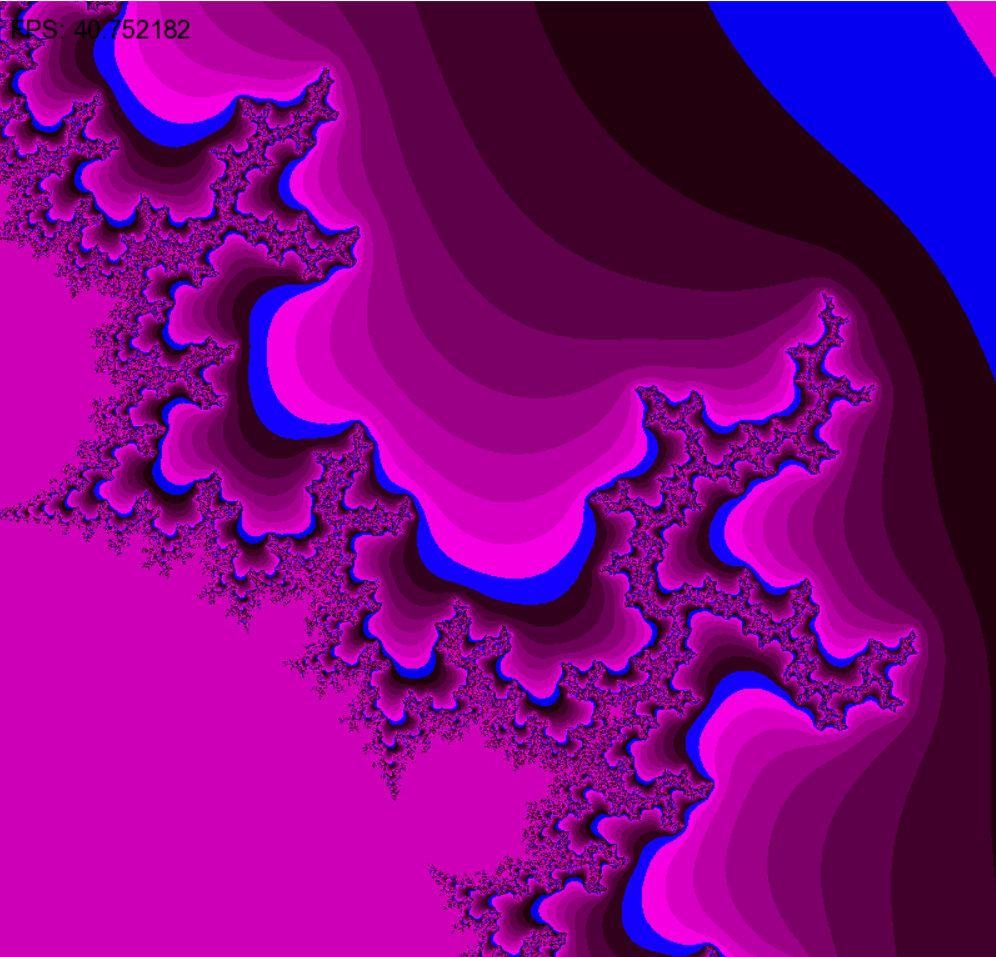

# **Mandelbrot set visualization**
Using C and SFML to visualize Mandelbrot using different optimizations
## Base version
Uses just 1 pixel processing per loop
## Unroll version
Processes 4 pixels at a time in one iteration of the loop
## Intrinsics version
Uses AVX (Advanced Vector Extensions) intrinsics to calculate 8 pixels in parallel using 256-bit registers. 

| version         |  FPS |
|-----------------|------|
| Base            | 11   |                                       
| Base       -O3  | 16   |  
| Intrinsics      | 30   |                                          
| Intrinsics -O3  | 120  |

