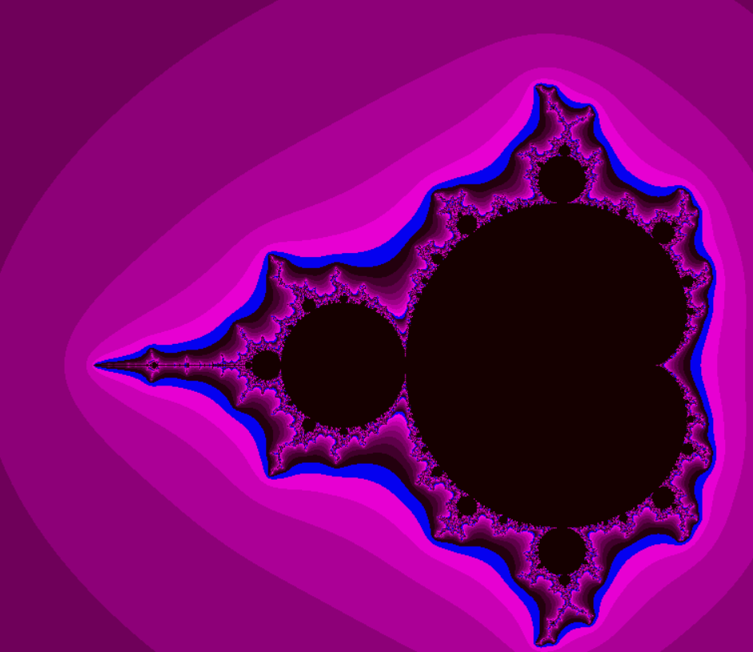
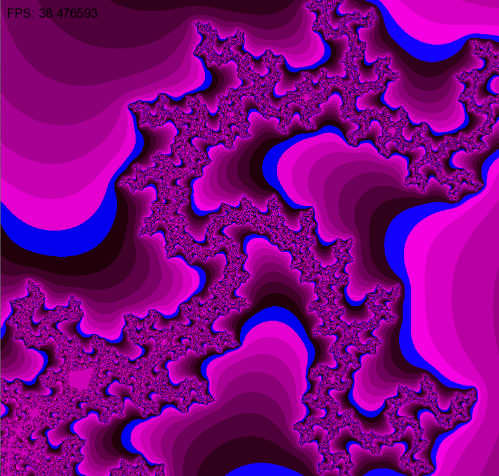

# **Mandelbrot set visualization**
Using C and SFML to visualize Mandelbrot using different optimizations

## Algorithm

1. The color of an image pixel depends on the number `N` (`output_number` in code).
2. The number `N` is the number of steps for which the **point** will go beyond the circle. If the point does not go beyond `N = 100` steps, then the calculating stops
3. The coordinates of the **point** are calculated using the formulas (`x[0]`, `y[0]` are the coordinates of the pixel being calculated):
* `x[i] = x[i - 1]^2 - y[i - 1]^2 + x[0]`
* `y[i] = 2 * x[i - 1] * y[i - 1] + y[0]`
4. SFML library calculates color in RGB format, my formula is:
  `(21 + output_number[i]*30), 0, (sf::Uint8)(0 + output_number[i]*30)`

## Compilation  
You need GCC compiler, make tool, SFML library

Example of installing (Linux) the SFML library (others are similar):
``` bash
sudo apt install libsfml-dev
```
Write ```make``` for create ```mandelbrot``` file

## Start
``` bash
./mandelbrot options
```
## Avaliable options:
### **"base"**

Uses just 1 pixel processing per loop
<details>
<summary> Code</summary>

```bash
void calculating_base(sf::Image* image)
{
    for (int yi = 0; yi < HEIGHT; yi++)
    {
        float Y0 = dy*(yi - Y_CENTER);
        for (int xi = 0; xi < WIDTH; xi++)
        {
            float X0 = dx*(xi - X_CENTER);

            float x = X0;
            float y = Y0;

            int output_number = 0;
            for (int counter = 0; counter < MAX_NUM_ITERATION; counter++)
            {
                float x2 = x  *  x;
                float xy = x  *  y;
                float y2 = y  *  y;
                float r2= x2 +  y2;

                int output_check = 0;
                if(r2 >= MAX_RADIUS) output_check = 1;

                if (output_check == 1) break;
                if(r2 <= MAX_RADIUS) output_number++;

                if (output_check == 0)
                {
                    x = x2 - y2 + X0;
                    y = 2 * xy + Y0;
                }

                set_color(image, xi, yi, output_number);
            }
        }
    }
}
```
</details> 

### **"unroll"**
<details>
<summary> Code</summary>
  
```bash
for (int yi = 0; yi < HEIGHT; yi++)
    {
        float Y0 = dy*(yi - Y_CENTER);
        float y0[NUM_POINTS] = {Y0, Y0, Y0, Y0};
        for (int xi = 0; xi < WIDTH; xi += NUM_POINTS)
        {
            float X0 = dx*(xi - X_CENTER);
            float x0[NUM_POINTS] = {X0, X0 + dx, X0 + dx*2, X0 + dx*3};

            float x[NUM_POINTS] = {}; for(int i = 0; i < NUM_POINTS; i++)  x[i] = x0[i];
            float y[NUM_POINTS] = {}; for(int i = 0; i < NUM_POINTS; i++)  y[i] = y0[i];

            int output_number[NUM_POINTS] = {};
            for (int counter = 0; counter < MAX_NUM_ITERATION; counter++)
            {
                float x2[NUM_POINTS] = {}; for(int i = 0; i < NUM_POINTS; i++)  x2[i] = x[i]  *  x[i];
                float xy[NUM_POINTS] = {}; for(int i = 0; i < NUM_POINTS; i++)  xy[i] = x[i]  *  y[i];
                float y2[NUM_POINTS] = {}; for(int i = 0; i < NUM_POINTS; i++)  y2[i] = y[i]  *  y[i];
                float r2[NUM_POINTS] = {}; for(int i = 0; i < NUM_POINTS; i++)  r2[i] = x2[i] +  y2[i];

                int output_check[NUM_POINTS] = {}; for(int i = 0; i < NUM_POINTS; i++) if(r2[i] >= MAX_RADIUS) output_check[i] = 1;
                int summ = 0;
                for(int i = 0; i < NUM_POINTS; i++) summ += output_check[i];
                if (summ == NUM_POINTS) break;
                for(int i = 0; i < NUM_POINTS; i++) if(r2[i] <= MAX_RADIUS) output_number[i]++;

                for (int i = 0; i < NUM_POINTS; i++)
                {
                    if (output_check[i] == 0)
                    {
                        x[i] = x2[i] - y2[i] + x0[i];
                        y[i] = 2 * xy[i] + y0[i];
                    }
                }
            }
            for(int i = 0; i < 4; i++)
            {
                set_color(image, xi+i, yi, output_number[i]);
            }
        }
    }
```
</details>
  
Processes 4 pixels at a time in one iteration of the loop
### **"intrinsics"**

Uses AVX (Advanced Vector Extensions) intrinsics to calculate 8 pixels in parallel using 256-bit registers. 

<details>
<summary> Code</summary>
                 
```bash
 __m256 index    =  _mm256_setr_ps(0.0, 1.0, 2.0, 3.0, 4.0, 5.0, 6.0, 7.0);
    __m256 dx_array =  _mm256_set1_ps(dx);
    __m256 offset   =  _mm256_mul_ps(dx_array, index);
    __m256 r2_max   =  _mm256_set1_ps(MAX_RADIUS*MAX_RADIUS);
    for (int yi = 0; yi < HEIGHT; yi++)
    {
        float Y0 = dy*(yi - Y_CENTER);
        __m256 y0 =  _mm256_set1_ps(Y0);
        for (int xi = 0; xi < WIDTH; xi += 8)
        {
            float X0 = dx*(xi - X_CENTER);
            __m256 X0_array = _mm256_set1_ps(X0);
            __m256 x0 = _mm256_add_ps(X0_array, offset);

            __m256 y = y0;
            __m256 x = x0;

           alignas(32) float output_number[8] = {};
            __m256 output_number_intrinsics = _mm256_setzero_ps();
            for (int counter = 0; counter < MAX_NUM_ITERATION; counter++)
            {

                __m256 x2 =  _mm256_mul_ps(x, x);
                __m256 xy =  _mm256_mul_ps(x, y);
                __m256 y2 =  _mm256_mul_ps(y, y);
                __m256 r2 =  _mm256_add_ps(x2, y2);

                __m256 cmp_mask   = _mm256_cmp_ps(r2, r2_max, _CMP_LT_OS);

                if (_mm256_testz_ps(cmp_mask, cmp_mask)) break;

               __m256 ones_array = _mm256_set1_ps(1);
               __m256 result = _mm256_and_ps(cmp_mask, ones_array);

                output_number_intrinsics = _mm256_add_ps(output_number_intrinsics, result);

                x = _mm256_sub_ps(x2, y2);
                x = _mm256_add_ps(x, x0);
                y = _mm256_add_ps(xy, xy);
                y = _mm256_add_ps(y, y0);

            }
            _mm256_store_ps(output_number, output_number_intrinsics);
            for(int i = 0; i < 8; i++)
            {
                set_color(image, xi+i, yi, output_number[i]);
            }
        }
    }
```
</details>

## Use

| key                                |  command       |
|------------------------------------|----------------|
| `W`                                |   up           |                                       
| `A`                                | left           |  
| `S`                                | down           |                                       
| `D`                                | right          |
| `C`                                | decrease scale |                                          
| `V`                                | increase scale |

## FPS

Frame calculation time is measured using ```__rdtsc()```
```bash
uint64_t time_end = __rdtsc();
...caclulating, rendering...
uint64_t time_end = __rdtsc();
float fps_value = (CPU_FREQ_GHz * 1e9) / (time_end - time_start);
```
  
| version                            |  FPS |
|------------------------------------|------|
| `Base`                             | 11   |                                       
| `Base`       -O3                   | 16   |  
| `Unroll`                           | 6    |                                       
| `Unroll`     -O3                   | 40   |
| `Intrinsics`                       | 30   |                                          
| `Intrinsics` -O3                   | 120  |

**Why is the `base` version faster than the `unroll` version? (without -O3 optimization)**

I looked at the assembler code with **godbolt** and found a few problems:

* large number of cycles with branching
* data is save not in **registers**, but on the **stack**
```bash
push    rbp
mov     rbp, rsp
sub     rsp, 104  ; reserve place on stack
```
All this slows down the program, unlike the simple code in the **base** version, where data is save in **registers** and the number of cycles is **minimal**.

With `-O3` optimization, the compiler stores data in **registers**, vectorizes calculations


## My system
CPU: Intel(R) Core(TM) i5-9300H CPU @ 2.40GHz

Compiler: G++

OS: Ubuntu WSL2

## Some beautiful picture





